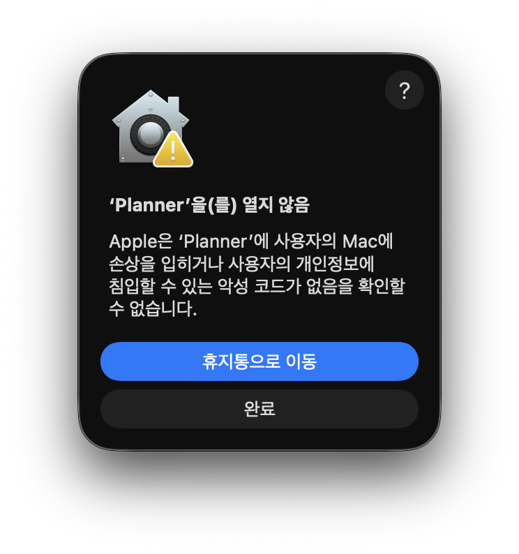
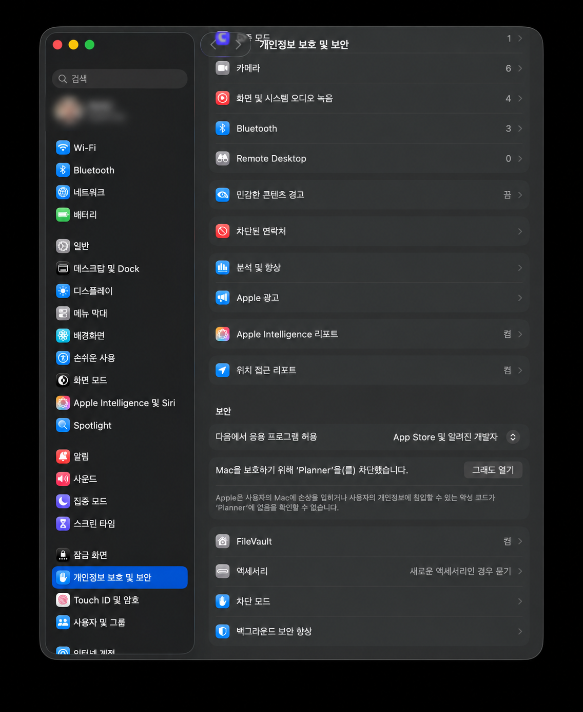
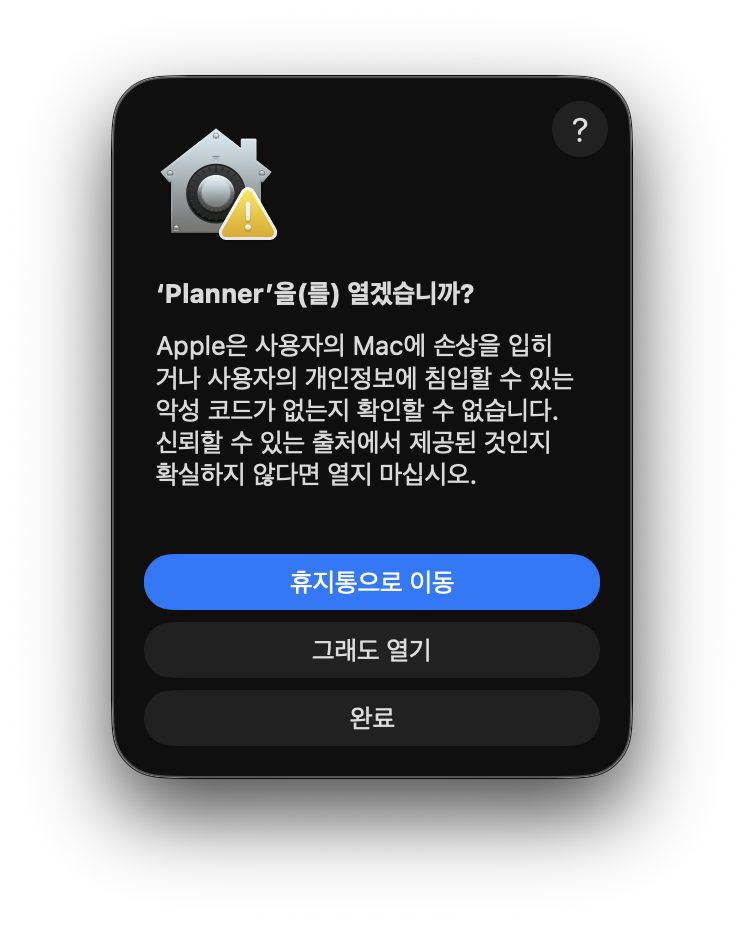
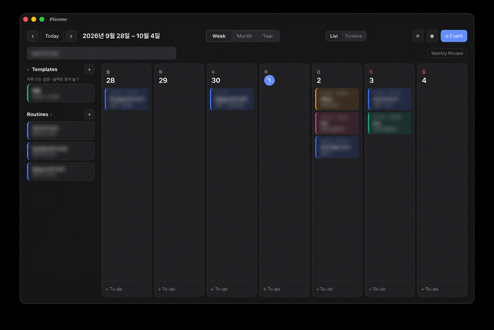
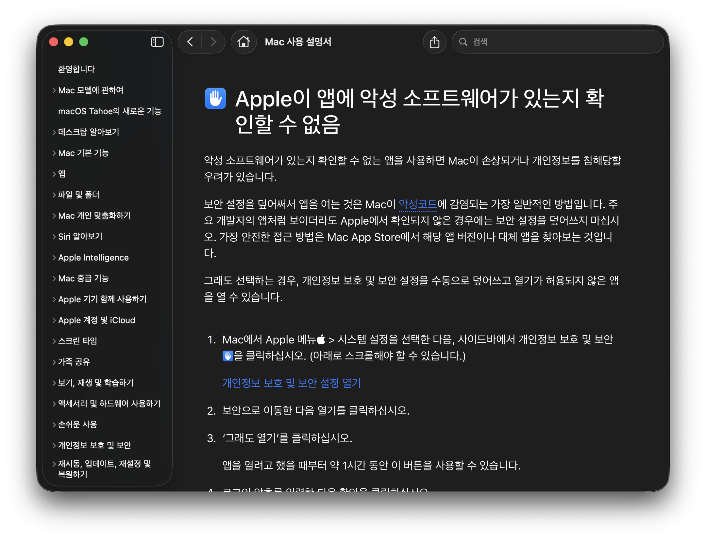

<p align="center">
  
</p>

<h1 align="center">Planner</h1>

<p align="center">개인 일정 관리를 위한 미니멀 맥 플래너</p>

---

## 요구 사항

- macOS 11 이상, Apple Silicon(M1 이상) 맥

## 설치

1. [Releases](https://github.com/jiin-jung/planner/releases/latest)에서 `Planner_x.y.z_aarch64.dmg`를 다운로드합니다.
2. 파일을 열고 **Planner**를 응용 프로그램 폴더로 드래그합니다.
3. 응용 프로그램에서 **Planner**를 실행합니다. Apple Developer ID로 서명되지 않은 앱이라 처음 실행할 때 차단 안내가 나타날 수 있습니다.

### 처음 실행이 차단될 때

아래 화면은 macOS에서 촬영했습니다. macOS 버전에 따라 문구와 화면 배치가 다를 수 있습니다.

1. **‘Planner’을(를) 열지 않음** 안내가 뜨면 **완료**를 누릅니다.

   

2. **시스템 설정 → 개인정보 보호 및 보안**으로 이동하고, 아래로 스크롤해 **보안** 항목을 찾습니다. Planner를 차단했다는 메시지 옆의 **그래도 열기**를 누릅니다.

   

3. **‘Planner’을(를) 열겠습니까?** 확인 창에서 **그래도 열기**를 누릅니다. Mac 인증을 요청하면 화면 안내를 따릅니다.

   

4. Planner가 열리면 설치가 완료됩니다.

   

<details>
<summary>Apple 도움말 화면 보기</summary>



</details>

이 저장소의 Releases에서 받은 파일인지 확인한 뒤 진행하세요.

터미널을 사용하는 경우 다음 명령으로도 실행 차단을 해제할 수 있습니다.

```bash
xattr -dr com.apple.quarantine /Applications/Planner.app
```

업데이트할 때도 같은 방법으로 덮어쓰면 되고, 데이터는 그대로 유지됩니다.

## 다운로드 파일 확인

Planner는 이 저장소의 Releases 페이지에서만 다운로드하세요. 서명되지 않은 앱은 macOS만으로 누가 만들었는지 확인할 수 없으니, 직접 검증하는 것을 권장합니다.

```bash
# 이 저장소의 소스 코드로 GitHub Actions에서 빌드됐는지 확인
gh attestation verify Planner_0.4.5_aarch64.dmg -R jiin-jung/planner

# 또는 같은 릴리스의 SHA256SUMS.txt와 해시 비교
shasum -a 256 Planner_0.4.5_aarch64.dmg
```

## 최초 실행

처음 실행하면 주요 기능과 설정을 안내하는 가이드가 나옵니다. ⚙︎ 설정 → **가이드 다시 보기**로 언제든 다시 볼 수 있어요.

- **알림 권한** — ⚙︎ 설정 → **테스트 알림**을 누르면 macOS가 알림 권한을 묻습니다. **허용**을 누른 뒤, 시스템 설정 → 알림 → Planner에서 알림 스타일을 **지속적 표시**로 두면 알림이 닫을 때까지 남아 있습니다.
- **위젯** — 메뉴 막대의 달력 아이콘을 클릭하고 **📌**를 누르면 오늘 일정이 화면에 계속 떠 있습니다. 위치와 크기는 기억됩니다.
- **자동 실행** — ⚙︎ 설정에서 **로그인 시 자동 실행**을 켜면 Mac을 재시작한 뒤에도 메뉴 막대와 위젯이 자동으로 켜집니다.

창을 닫아도 앱은 메뉴 막대에서 계속 실행되며 알림을 보냅니다. 완전히 종료하려면 `⌘Q`를 누르세요.

## 기능

- **보기** — Week · Month · Year, 주간 List / Timeline
- **Routine** — 매주 · 격주 · 매월 n번째 반복, 회차별 메모 모아보기
- **빠른 추가** — `내일 3시 헬스 @학교` 한 줄로 입력
- **Template** — 자주 쓰는 일정을 저장해 두고 날짜로 드래그
- **Prep · To-do** — 일정별 준비 체크리스트, 메모의 `- [ ]` 는 To-do로
- **Due** — D-day 표시와 전날 · 당일 알림
- **Weekly Review** — 한 주 요약과 남은 To-do 옮기기
- **백업** — 매일 자동 백업, JSON 내보내기 · 가져오기, `.ics` 캘린더 내보내기

| 키 | 동작 | 키 | 동작 |
|---|---|---|---|
| `⌘K` | 빠른 추가 | `⌘F` | 검색 |
| `⌘Z` | 실행 취소 | `v` | Weekly Review |
| `w` `m` `y` | Week · Month · Year | `c` | Templates |
| `←` `→` | 이동 | `t` | Today |

## 앱이 저장하는 정보

| 내용 | 위치 |
|---|---|
| 일정 데이터 | `~/Library/Application Support/com.jiin.planner/planner.json` |
| 자동 백업 (최근 14일) | 같은 폴더의 `backups/` |
| 위젯 위치 · 데이터 위치 설정 | 같은 폴더의 `widget.json`, `config.json` |
| iCloud Drive를 선택한 경우 | `iCloud Drive/Planner/planner.json` |
| 로그인 시 자동 실행을 켠 경우 | `~/Library/LaunchAgents/`의 Planner 항목 |
| 내보낸 파일 (.json · .ics · .md) | `~/Downloads` |

앱이 절대로 하지 않는 일:

- 인터넷에 접속하지 않습니다. 앱이 보내는 네트워크 요청은 없고, 보안 정책(CSP)으로 외부 연결을 차단합니다.
- 계정, 로그인, 분석 · 추적 도구가 없습니다.
- 일정 데이터를 위 위치 밖으로 보내거나 복사하지 않습니다.

## 알아둘 점

- 데이터는 이 Mac(또는 선택한 iCloud Drive)에만 있습니다. Mac을 바꾸거나 초기화하기 전에 ⚙︎ 설정 → **백업 파일 저장**으로 내보내 두세요.
- 앱을 지우려면 응용 프로그램에서 Planner를 삭제하고, 데이터까지 지우려면 위 `com.jiin.planner` 폴더를 삭제합니다. 자동 실행을 켰다면 먼저 설정에서 꺼 주세요.
- 이 프로젝트는 개인 프로젝트이며 어떠한 보증도 제공되지 않습니다([LICENSE](LICENSE) 참고).

## 개발

```bash
npm install
npm run dev                  # 실행
npm run release -- 0.4.5     # 버전을 올리고 태그 푸시 → GitHub Actions가 dmg 빌드
```

Tauri 2 · Vanilla JS · Rust · [MIT License](LICENSE)
